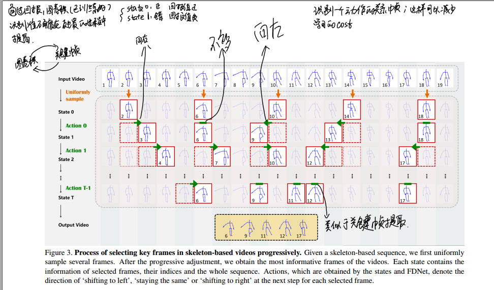
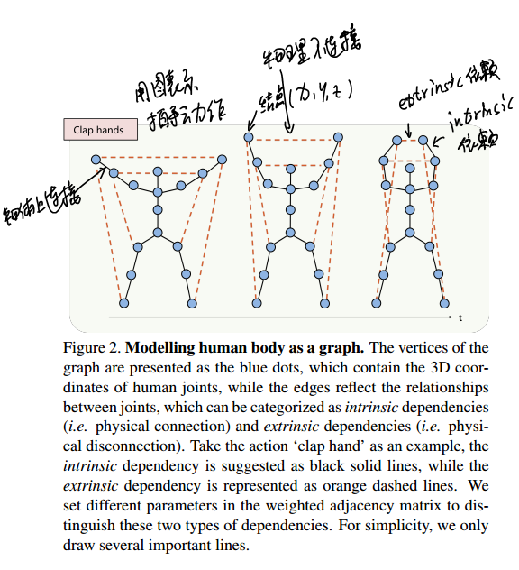
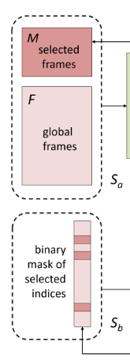
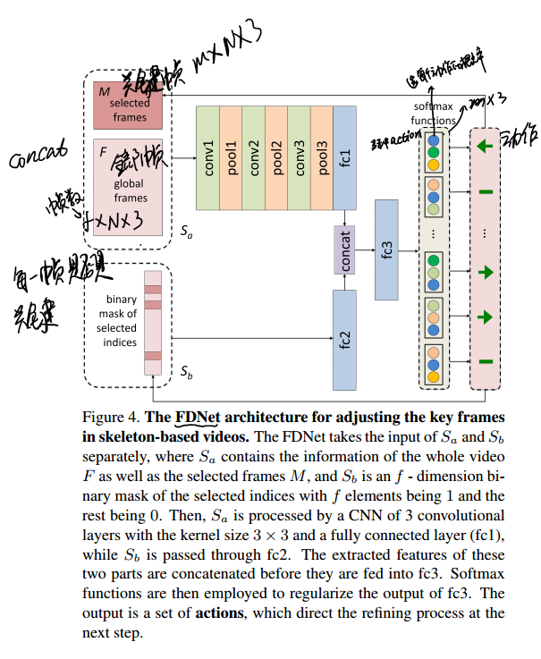
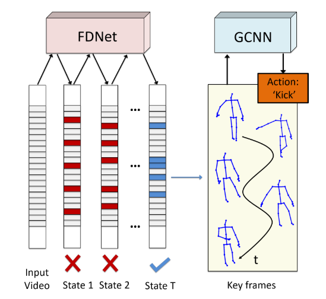
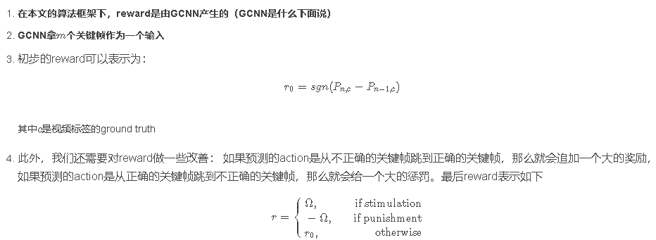
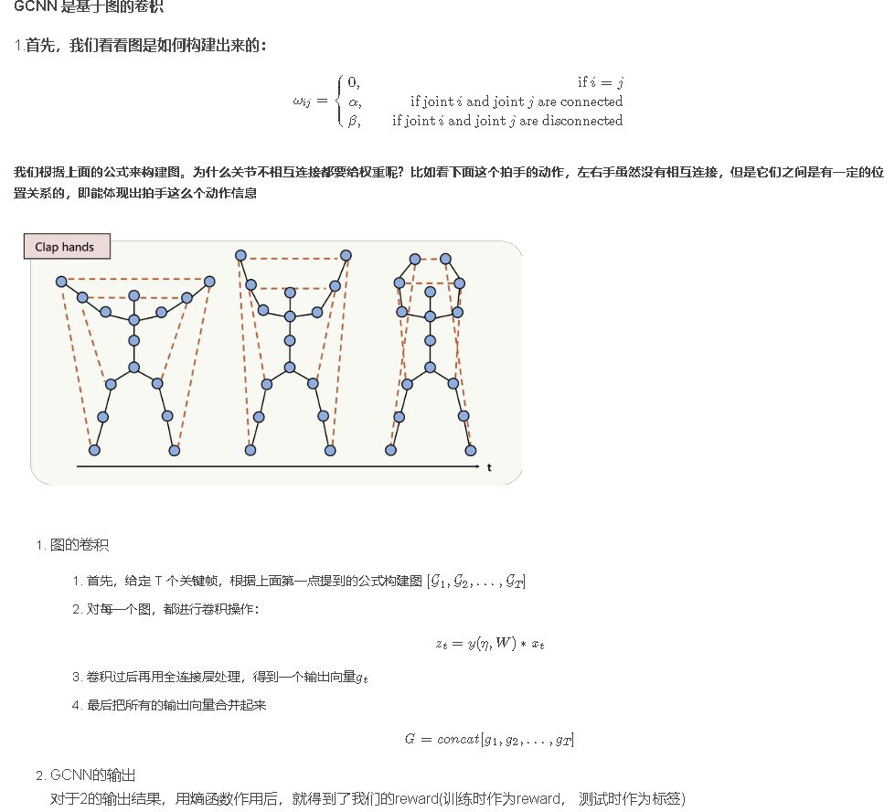
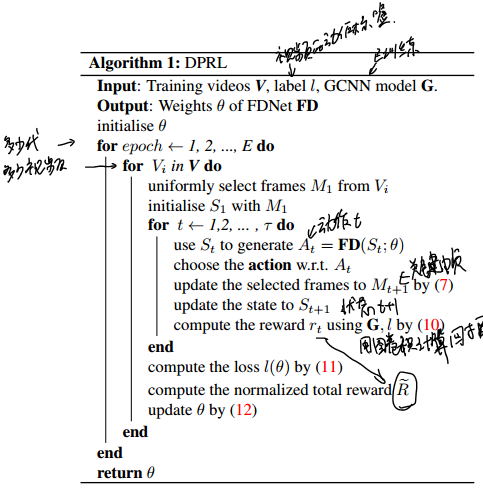

* [paper](paper/2018-Deep%20Progressive%20Reinforcement%20Learning%20for%20Skeleton-based%20Action%20Recognition.pdf)

### 动机

* 这篇文章开篇就指出，我们的模型是要从人体动作的序列中选取出最informative的那些帧，而丢弃掉用处不大的部分。但是由于对于不同的视频序列，挑出最有代表性的帧的方法是不同的，因此，本文提出用深度增强学习来将帧的选择模拟为一个不断进步的progressive process。
* 强化学习是通过优化选择actions的policy来最大化agent从environment所获得的rewards。文章中说    至今为止，在动作识别领域，增强学习的应用还不多。
* 做skeleton based action recognition会用到人体关节的邻接矩阵，之前做skeleton based action recognition基本都是有骨骼相连的关节对才会在邻接矩阵的相应位置标记一个1，没有连接的位置就标记为0
* 但本文不同，本文考虑到不相连的关节之间的相互关系也是很重要的，比如两只手不是直接相连的，但是两只手的相互位置关系在识别‘拍手’这个动作时就尤为重要。

### 方法

* 本文的人体关节邻接矩阵是这么设计的：如果两个关节有连接，就在邻接矩阵相应位置标记为α，称之为intrinsic dependencies，否则标记为β，称之为extrinsic dependencies。此外关节没有self connection，是邻接矩阵对角元素全是0.
* 思路简单概括为： 
  1. 我们的输入是一段视频，视频中有多个帧。 
  2. 我们想用RL的算法来选择关键帧（本文是FDNet） 
  3. 再把选取到的关键帧输入到GCNN网络，得到这个vedio的标签

### 定义问题的决策链

1. 已知输入的是含有多个帧的一段视频，但我们不要全部用到全部帧数

2. 所以我们想提取关键帧，设定提取的关键帧数为m,把这m个关键帧按序号排序，每一个action表示这些关键帧是要向左移动，向右移动或是保持当前位置。

3. 设定迭代步数，当程序迭代步数达到设定值时，就停止程序；

   

### State and Action

#### State

1. 针对选关键帧这个MDP问题，状态S可以表示为： {Sa,Sb}

2. 即它由来两部分组成，其中Sa=[F,M] 也是由两部分组成的。F表示整个视频的信息， 它张量的形状为：f×N×3。 其中f表示视频的所有帧数，N表示每一帧中的骨架模型的节点数，3表示每一个骨架节点的3D坐标。 如下图所示是一个拍手动作的其中三帧，每一帧都是用一些骨架信息表示，其中包含了骨架中有多少个关节节点以及它们的3D坐标。 

3. 对于M就表示所有被提取的关键帧信息，用一个形如m×N×3的张量表示，其中m表示关键帧的数目
4. 最后Sb one-hot, 它对应到整个视频的每一帧，如果对应的元素值为1,那么说明该帧被提取为关键帧，其余则为0 ;

#### Action

**action的动作由FDNet输出** 
action的定义比较简单： 

1. 帧向左移动 
2. 帧向右移动 
3. 帧保持不动

* **现在，我们打开看一下FDNet网络的结构** 

### Reward function

###  GCNN

### 算法

